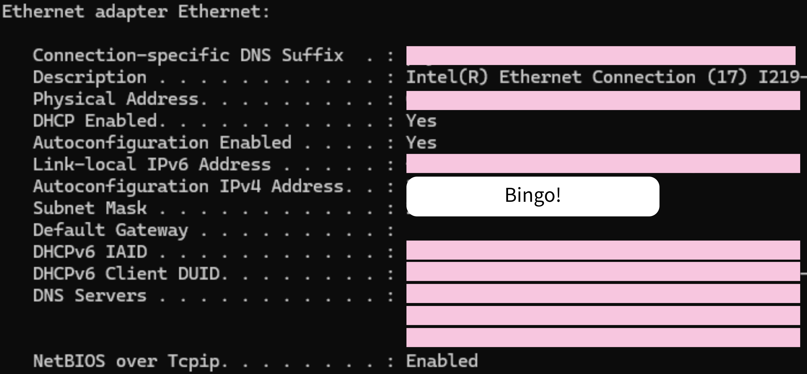

# Intro 

Experiments require instruments. Instruments have knobs. (Ethical) labor is expensive $\implies$ *Remote instrument control*. In the past, instrument manufacturers provided gateways for device programming, but independently of other manufacturers. As a consequence, we're left with a clutter of different protocols, interfaces, and buses (GPIB, RS232, USB, Ethernet). 

## VISA
In the (19)90s, to combat this problem, several instrument manufacturing powerhouses agreed to develop a standard for device communication. The Virtual Instruments Software Architecture (VISA) was the culmination of those efforts, providing an Application Programming Interface (API) for instrument control over the various bus systems available.

There are several implementations of VISA. National Instruments VISA (NI-VISA) is the most common and well-supported, but there may be instances where another implementation is required. The image below outlines the software heirarchy of an instrument control scheme from the bus drivers to the high-level application. Note where NI-VISA sits.   

<figure markdown="span">
  { loading=lazy }
  <figcaption>Control Layers for the NI-VISA system
  <!-- work around to get footnote to render properly -->
  <sup id="fnref:1">
    <a class="footnote-ref" href="#fn:1">1</a>
  </sup>
  </figcaption>
</figure>

 
Importantly, on top of the NI-VISA download, you'll also need the NI-Drivers for certain buses like GPIB, RS and VXI. For USB and Ethernet connections, NI-VISA has in-built support. 

## SCPI 
The Standard Communications Protocol for Instruments (SCPI, pronounced 'skippy' like the 8th dwarf) was another product of standardization. It defines a format for the communication comands to be sent and received by an instrument[^3]. A SCPI string consists of repeated command blocks that take the form 

\[
\textrm{\small cmd}\overbrace{:\textrm{\small subcmd}}^{*}\textrm{\small{[?]}} \quad [\textrm{\small param }\underbrace{\textrm{,param}}_{*}]
\]

The $*$ indicates that the specified string can be repeated indefinitely and strings within square brackets [ ] are optional. Commands are scoped by colons $:$ which are followed by a comma separated string of parameters which may or may not be required depending on the specific command. Multiple SCPI command blocks are separated by semicolons. Commands are either 'queries' (indicated by the question mark) or 'writes'. See the figure below for a sample of the YokogawaGS820 command tree 

<figure markdown="span">
  { loading=lazy }
  <figcaption>Sample from YokogawaGS820 Command Tree
  <!-- work around to get footnote to render properly -->
  <sup id="fnref:2">
    <a class="footnote-ref" href="#fn:2">2</a>
  </sup>
  </figcaption>
</figure>

## pyvisa
pyvisa can serve as both a high-level wrapper for an existing VISA installation and an implementation of VISA itself. In the first case, pyvisa calls functions in a VISA backend to manage instrument communication, whereas, in the latter, the bus protocols are directly managed in python through other libraries. 

**Examples** 

1. [PHY405 initialization script](/QCoDeS/src/pyVisa_testing/PHY405_Test_USB_Control.py) Initalization of multiple instruments 
2. [yoko+kiethley_sweep](/src/pyvisa_examples/sweep.py) Linear voltage sweep with YokogawaGS820 channel as source and KeithleyDMM6500 as measurement probe

    <!-- **Requires**
    1. [Custom Keithley and Yoko Class](/QCoDeS//src/pyVisa_testing/instruments.py): Abstracts away SCPI command details.  -->


For simple configurations, pyvisa is a convenient option, and moreover, serves as foundation for qcodes. Take time to understand how to use it. 

### Resources
1. [Youtube tutorial](https://www.youtube.com/watch?v=1HQxnz3P9P4): Overview of pyvisa and SCPI with example code
2. [Blog Post by lui_gough](https://goughlui.com/2021/03/28/tutorial-introduction-to-scpi-automation-of-test-equipment-with-pyvisa/): Introduces SCPI automation and highlights various pitfalls. Discusses bus systems and synchronization techniques
3. [RhodeSchwartz Remote Instrumentation Guide](https://www.rohde-schwarz.com/ca/driver-pages/remote-control/drivers-remote-control_110753.html): Comprehensive look at remote instrumentation. Links to some proprietary RhodeSchwarz software not compatible with other instruments

## Configuring Bus sytems
Remote Instrumentation can only be so remote, you still have to get in touch with the instruments themselves. Here are some tips for configuring certain bus systems

### GPIB
Since most modern PC's don't support GPIB natively, you will likely need a GPIB-USB adaptor. You can then connect multiple instruments over GPIB by 'daisy-chaining' the cables as long as the GPIB-USB adaptor is connected to one junction of the chain. 

It is also necessary to configure the GPIB addresses of each instrument to be distinct from one another. This requires familiarizing yourself with the manual interface for your instrument.

If you are using the NI-VISA installation, you also need the NI-488.2 GPIB driver so that your installation can communicate over GPIB. For other VISA installations, check their instructions. **TODO** you do it. 

### USB 
Largely just plug and play, no additional NI driver needed. 

### RS-232
This is a fairly outdated protocol. If you do have to use it, remember to install the NI-Serial driver.

### Ethernet 
When statically configuring your device's ethernet settings, take the following steps 

1. **Disable [DHCP](https://en.wikipedia.org/wiki/Dynamic_Host_Configuration_Protocol "Dynamic Host Configuration Protocol")**: Most of the time, you won't be able to tinker any ethernet settings unless this is disabled. 
2. **Determine IP address and subnet mask of ethernet adaptor**: Open the command line and run 

    === "Windows"
        ```bash
        ipconfig /all
        ```
    === "Linux/Mac"
        ```bash
        ifconfig # on mac can view system ethernet settings
        ```
    Find the IP address and subnet mask associated with your ethernet adapter. If you have multiple ethernet ports on your pc, make sure you find the right one. 

    <figure markdown="span">
    { width="600", loading=lazy }
    <figcaption>Example `ipconfig /all` output on windows machine</figcaption>
    </figure> 
    IP addresses and subnet masks are 32 bit numbers expressed as
    period separated groups of 4 bytes represented in decimal. Thus, each group is represented by a number from 0 to $255 = 2^8 - 1$. Hence, in the above example, our subnet mask in binary is $1^{16}0^{16}$, by which we mean 16 1s followed by 16 0s. 

    The ethernet protocol will perform a bitwise-and operation on the subnet mask and the destination ip address to help determine where to route packets.

3. **Configure Instrument** Follow the instructions in your instrument's manual to set your instruments subnet mask to match the pc's. Then choose an IP address (not equal to the pc's) which matches the pc's wherever the subnet mask has a bit 1. In the above example, we are free to set the device's IP address to anything of the form `169.254.xxx.xxx` since the subnet is 1 in the first 16 bits and 0 in the last. 

4. **Test Ethernet Connection** Open a terminal/command prompt on your pc and ping the device. If we set a device to ip address `169.254.169.1`, then execute `ping 169.254.169.1`. If the ping fails, redo the last steps. If it still fails, then check your instrument manual to see if there are further requirements on the ethernet cable standard that should be used. 
    <figure markdown="span">
    { width="500", loading=lazy }
    <figcaption>Example successful ping output</figcaption>
    </figure>

5. **Test Visa Connection** Open NI-MAX (should come with your NI-VISA installation).
    ```
        Devices and Interfaces > Create New > VISA TCP/IP Resource > Auto-detect of LAN Instrument
    ```
    <figure markdown="span">
      { width="600", loading=lazy }
        <figcaption>NI-MAX autodetect LAN</figcaption>
    </figure>    
    You should be able to find your device ip addresses here. Copy the VISA address displayed corresponding to your instrument and use your choice of pyvisa, qcodes, or even NI MAX itself to test that your device can send/receive data over ethenet.
    *Remark* in pyvisa, remember to set your write and read termination characters. 


## What's missing?
As your experimental setup grows, it becomes increasingly difficult to manage all the various instrument-specific command interfaces. The inclination with pyvisa is to write drivers for yourself to abstract away the lower level SCPI commands.  

## QCoDeS shows up
Another layer of abstraction higher than pyvisa with many more features. Aims to quench the desire for instrument modules that you'd likely end up developing yourself (see [Examples 2](#pyvisa-and-scpi)) The library provides drivers for a number of common instruments and is robustly featured in hopes of delivering all the software required for large-scale experimental setups. 
 

**Installation**
Follow the [Getting Started](http://microsoft.github.io/Qcodes/start/index.html) section of the qcodes docs. Use the recommended approach with miniconda, but make sure to use the latest version of python you installed when setting up the conda environment. The latest qcodes version requires python 3.11 and up as opposed to 3.9 as currently specified in the docs. If nothing else, run `pip install qcodes` (like I did). The issue here is that as qcodes develops, there may be some compatibility problems in the future.  


[^1]: greetings 
[^2]: [YokogawaGS820 Documentation](https://tmi.yokogawa.com/ca/solutions/products/generators-sources/source-measure-units/gs820-multi-channel-source-measure-unit/#Documents-Downloads____downloads_4)
[^3]:  Many instruments have support for several command protocols so you may have to configure your instrument for SCPI. We discuss SCPI here since it's so ubiquitous, but you can use the command scheme of your choice.